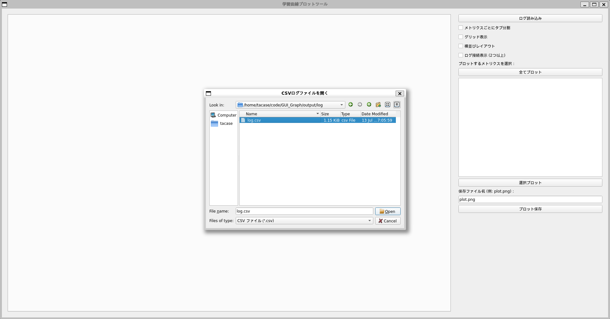
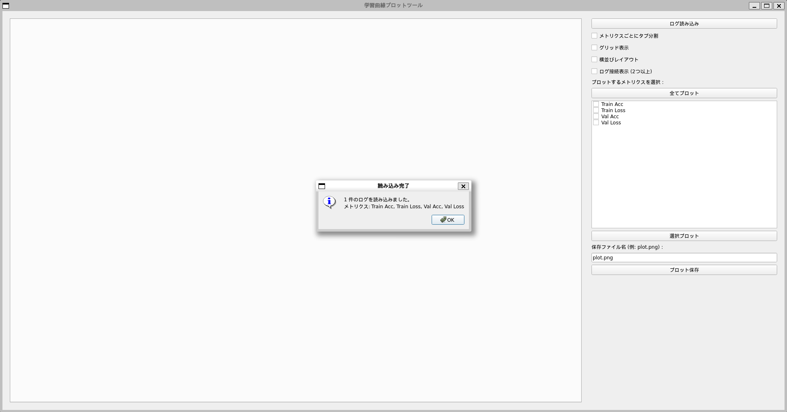
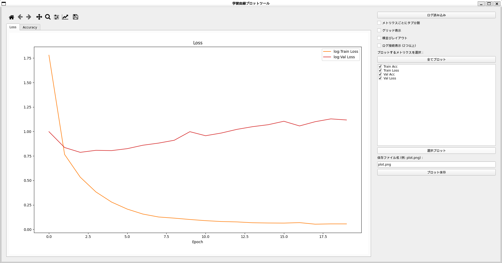
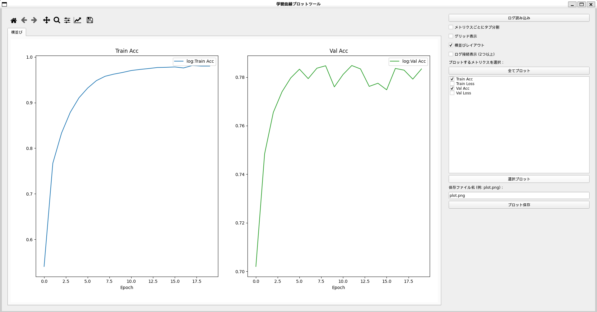
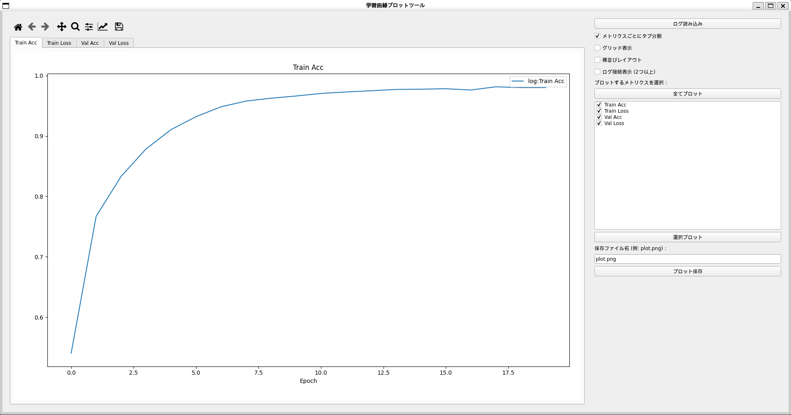
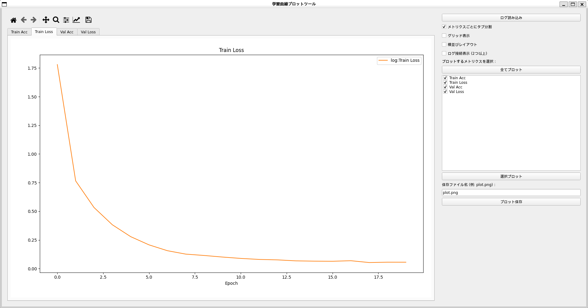
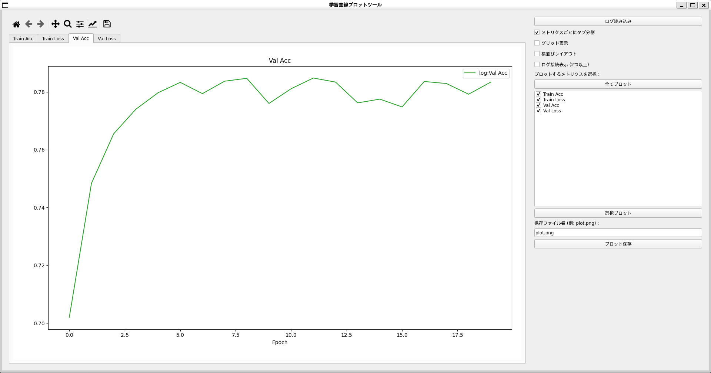
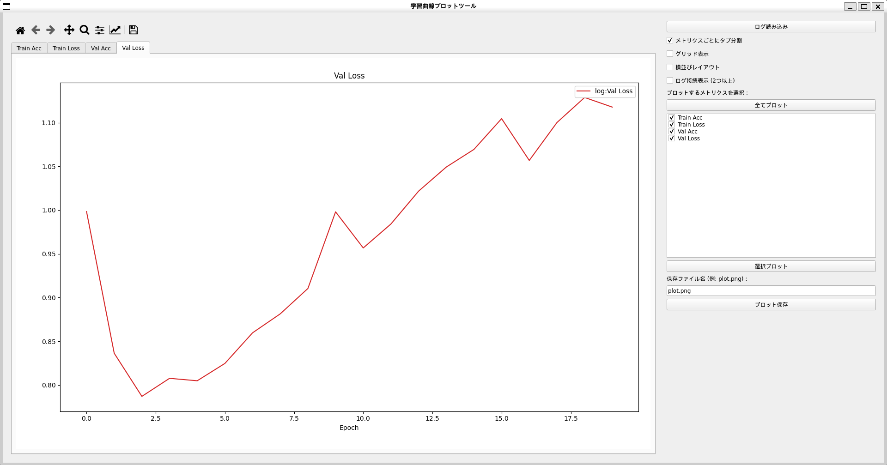
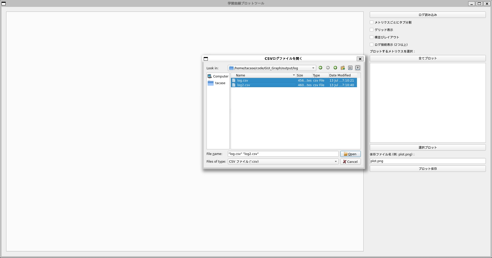
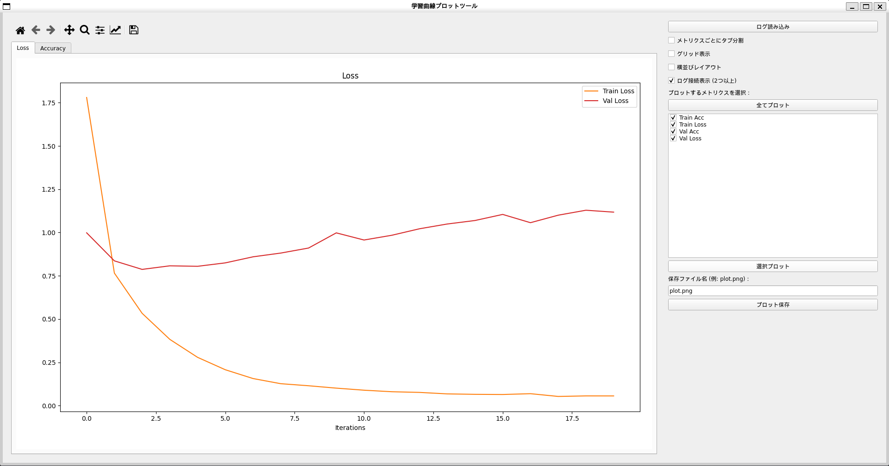

# GUI_Graph
学習曲線表示用のGUIツール

## ファイル＆フォルダ一覧

<details>
<summary>フォルダ</summary>
 
|ファイル名|説明|
|----|----|
|Config|学習用のハイパーパラメータが記載されたConfigファイルが格納されたフォルダ．|
|fig|README用の画像を保存するフォルダ．|
|output|学習結果のログやモデルを保存するフォルダ．|
</details>

<details>
<summary>ファイル</summary>
 
|ファイル名|説明|
|----|----|
|plot_gui_graph.py|GUI上でCSVファイルを読み込んで，グラフを可視化するコード．|
|train.py|ResNet-18を学習するコード．|
|trainer.py|学習ループのコード．|


|ファイル名|説明|
|----|----|
|Config/resnet_config.py|ResNet-18用のハイパーパラメータが定義されたコード．|

</details>

## 実行手順
### 事前準備
* 必要なライブラリをインストール
```
pip install numpy pandas matplotlib PyQt5
```

* 以下のような形式で CSV を用意してください(順不同です)

基本例
| epoch | train_loss | val_loss | train_acc | val_acc |
|:-----:|-----------:|---------:|----------:|--------:|
| 1     |     2.3456 |   2.7890 |     50.12 |   48.75 |
| 2     |     1.9876 |   2.4567 |     52.34 |   50.10 |
| 3     |     1.6789 |   2.1234 |     55.67 |   53.21 |
| …     |        …   |      …   |        …   |     …   |

epoch：イテレーション番号またはエポック数

train_*：学習時のメトリクス

val_*：検証時のメトリクス

_*_loss：損失

_*_acc：精度（%）

複数の損失がある場合(順不同です)
| epoch | train_loss | train_cls_loss | train_reg_loss | val_loss | val_cls_loss | val_reg_loss | train_acc | val_acc |
|:-----:|-----------:|---------------:|---------------:|---------:|-------------:|-------------:|----------:|--------:|
| 1     |     1.2345 |         0.5678 |         0.6667 |   1.4567 |       0.6789 |       0.7778 |     75.23 |   72.81 |
| 2     |     0.9876 |         0.4567 |         0.5309 |   1.1234 |       0.5432 |       0.5802 |     78.65 |   75.45 |
| 3     |     0.8765 |         0.3456 |         0.5309 |   0.9999 |       0.4321 |       0.5678 |     80.12 |   77.34 |
| …     |        …   |             …  |             …  |      …  |           …  |           …  |       …   |     …   |

train_cls_loss／val_cls_loss：分類損失

train_reg_loss／val_reg_loss：回帰損失


### 学習
ハイパーパラメータ等は，Configフォルダ内の各ファイルで設定してください．

* ResNet-18のファインチューニング(CIFAR-10)
```
$ python train.py --config_path ./Config/resnet_config.py
```

### 描画

#### 1，描画ツールの起動
```
python plot_gui_graph.py
```


#### 2，読み込むCSVファイルを選択


#### 3，`OK`ボタンをクリック


#### 4，可視化したい対象を右のチェックボックスで選択して，`選択プロット`ボタンをクリック


#### 5，可視化結果


##### 5-1，横並びで表示
* 表示したい対象だけチェックボックスで選択して，`選択プロット`ボタンクリックし，`横並びレイアウト`のチェックボックスを選択することで，選択した対象だけを横並びにして表示


##### 5-2，分割で表示
* 表示したい対象だけチェックボックスで選択して，`選択プロット`ボタンクリックし，`メトリクスごとにタブ分割`のチェックボックスを選択することで，複数のグラフをタブごとに分割して表示





##### 5-3，2つのCSVファイルの連結して表示
* 5-3-1，読み込むCSVファイル2つを選択し，上記の3，4を実施


* 5-3-2，`ログ接続表示 (2つ以上)`のチェックボックスを選択することで，複数のCSVファイルを連結して1つのグラフとして表示

