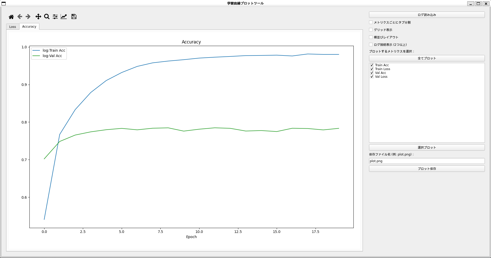

# GUI_Graph
Metric Learningのサンプルコード

## ファイル＆フォルダ一覧

<details>
<summary>フォルダ</summary>
 
|ファイル名|説明|
|----|----|
|Config|学習用のハイパーパラメータが記載されたConfigファイルが格納されたフォルダ．|
|fig|README用の画像を保存するフォルダ．|
|output|学習結果のログやモデルを保存するフォルダ．|
</details>

<details>
<summary>ファイル</summary>
 
|ファイル名|説明|
|----|----|
|plot_gui_graph.py|GUI上でCSVファイルを読み込んで，グラフを可視化するコード．|
|train.py|ResNet-18を学習するコード．|
|trainer.py|学習ループのコード．|


|ファイル名|説明|
|----|----|
|Config/resnet_config.py|ResNet-18用のハイパーパラメータが定義されたコード．|

</details>

## 実行手順

### 学習
ハイパーパラメータ等は，Configフォルダ内の各ファイルで設定してください．

* ResNet-18のファインチューニング(CIFAR-10)
```
$ python train.py --config_path ./Config/resnet_config.py
```

### 描画

* 1，描画ツールの起動
```
python plot_gui_graph.py
```


* 2，読み込むCSVファイルを選択


* 3，`OK`ボタンをクリック


* 4，可視化したい対象を右のチェックボックスで選択して，`選択プロット`ボタンをクリック


* 4，可視化したい対象を右のチェックボックスで選択して，`選択プロット`ボタンをクリック


* 5，可視化結果


* 5-1，比較したい対象だけチェックボックスで選択して，`選択プロット`ボタンクリック，`横並びレイアウト`のチェックボックスを選択することで，比較結果だけを横並びで表示


* 5-2，比較したい対象だけチェックボックスで選択して，`選択プロット`ボタンクリック，`メトリクスごとにタブ分割`のチェックボックスを選択することで，複数のグラフをタブごとに分割表示


